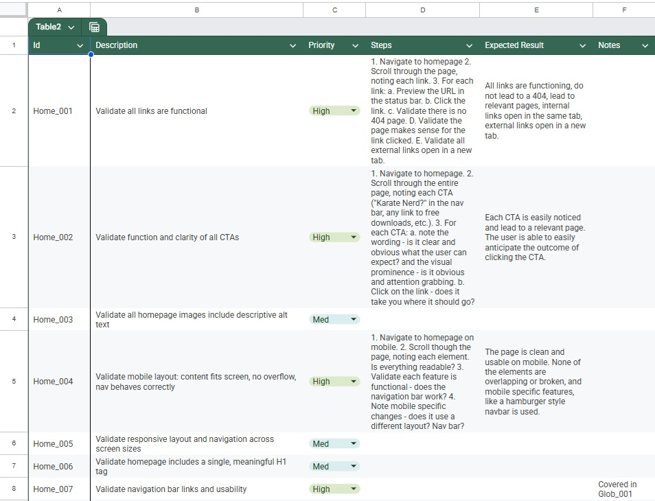
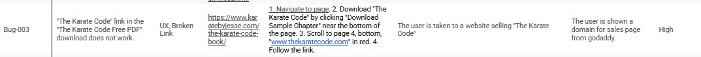
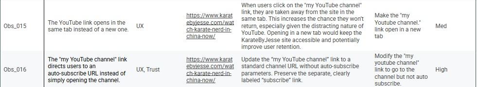

# KarateByJesse.com QA Audit

A manual QA audit of KarateByJesse.com completed as an independent portfolio project.

## Overview

KarateByJesse.com is the personal website of martial artist and YouTuber Jesse Enkamp, where he sells instructional videos, martial arts equipment, and publishes content related to martial arts training and culture.

This project was approached as though I had been hired to perform a full QA audit of the site.

Rather than focusing exclusively on whether features worked as expected, this audit prioritized:

* User experience
* User flow
* Trust signals
* Accessibility
* Friction points that could impact engagement or purchasing decisions

---

## At a Glance

| Area             | Result                                      |
| ---------------- | ------------------------------------------- |
| Test Scenarios   | 80+                                         |
| User Flows       | 7                                           |
| UX Observations  | 17                                          |
| Confirmed Bugs   | 4                                           |
| Testing Type     | Manual                                      |
| Platforms Tested | Chrome (Windows 11), Chrome (iPhone 8 Plus) |

---

## Objectives

* Validate user flows for function and ease of use
* Identify UX issues that could erode user trust
* Validate basic accessibility standards
* Identify branding and navigation issues
* Validate links, media, and calls to action

---

## Scope

### Fully Tested

* Homepage
* Blog
* Contact
* About
* Sales Pages
* Footer
* Navigation
* Calls to Action

### Partially Tested

* Purchase flow (up to, but not including, completing a purchase)

### Not Tested

* Back-end systems
* User login areas

---

## Methodology

Testing was conducted manually on:

* Chrome (Windows 11 Home)
* Chrome (iPhone 8 Plus)

Testing combined:

* Exploratory testing
* Structured test cases
* Accessibility review
* Observational UX analysis

---

## Repository Contents

### Test Scenarios

80+ structured test scenarios covering functional behavior, UX concerns, accessibility, navigation, content, and sales flows.

### User Flows

Seven user journeys based on real user intent:

1. Consume More Content from Jesse
2. Buy a Gi
3. Explore Martial Arts for the First Time
4. Join a Martial Arts Community
5. Get Training
6. Contact Jesse
7. Learn About Jesse

### UX Observations

Seventeen observations related to usability, trust-building, design consistency, navigation, and user confidence.

### Bug Reports

Four confirmed bugs with:

* Reproduction steps
* Expected results
* Actual results
* Real-world impact

---

## Why This Project Was Structured Around User Flows

The test suite was built around the primary reasons users visit KarateByJesse.com rather than around individual pages or isolated features.

This approach kept testing focused on user goals and helped prioritize issues that would have the greatest impact on trust, engagement, and conversion.

---

## Reflection

This project helped clarify the difference between testing software and understanding what users actually need from it.

Many of the most impactful findings were not broken features, but broken trust signals such as outdated information, inconsistent calls to action, and points of unnecessary friction.

It also provided experience planning and managing a large QA effort over multiple weeks, including defining scope, prioritizing work, and maintaining a user-centered perspective throughout the audit.
